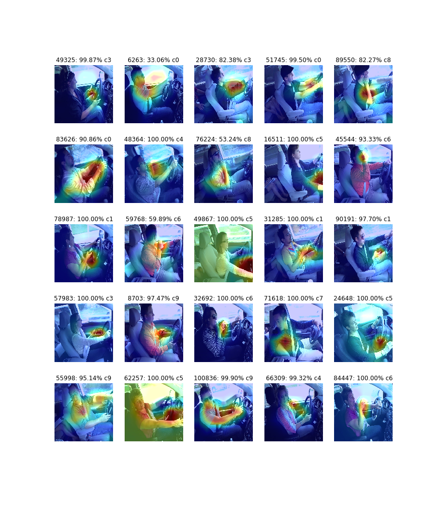
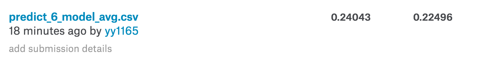

# Recognize distracted drivers, a compute vision contest from [Kaggle](https://www.kaggle.com/c/state-farm-distracted-driver-detection).

## 目录结构
* pj.ipynb：主要代码，包括数据预处理、模型训练和预测。
* presentation.ipynb：可视化工作的一些代码，包括了照片展示，图片统计，CAM和模型训练情况的线图。
* report-images：数据分析的展示图片。

## 依赖库和软件
* python2.7
* numpy
* Tensorflow
* Keras
* Sklearn
* Matplotlib
* OpenCV

## 注意事项
* presentation.ipynb会用到imgs/train_目录，该目录中存放的是将所有训练图片（不含子目录）。在命令行可以这样实现：

```
> cd imgs
> mkdir train_
> cp train/c*/*.jpg train_
```
## CAM
Project features into the space of convolution output
[(Class Activation Mapping)](http://cnnlocalization.csail.mit.edu/).


## 成绩

public score: 108/1440，private score: 123/1440 on leaderboard.

## 训练时间
项目中一共训练了8个模型，要得到最后的结果，大概需要2*8=16个小时。

